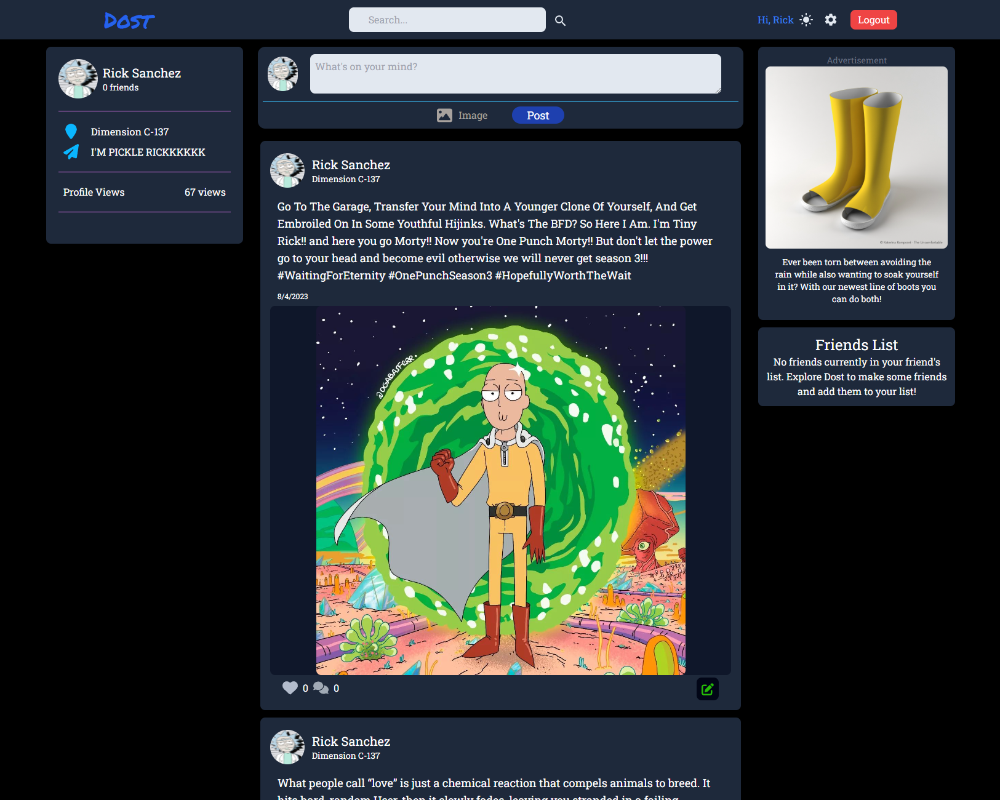
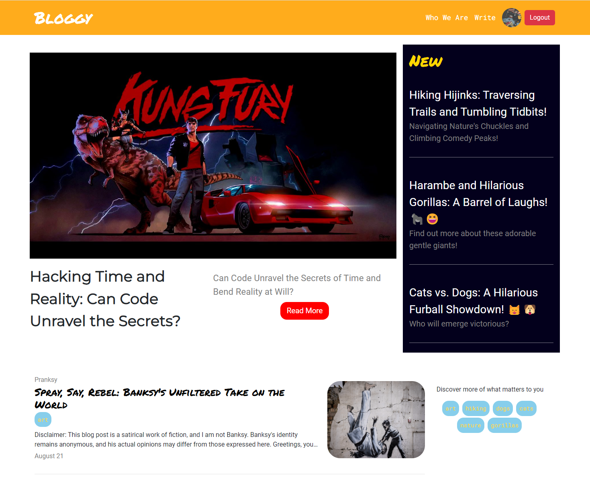
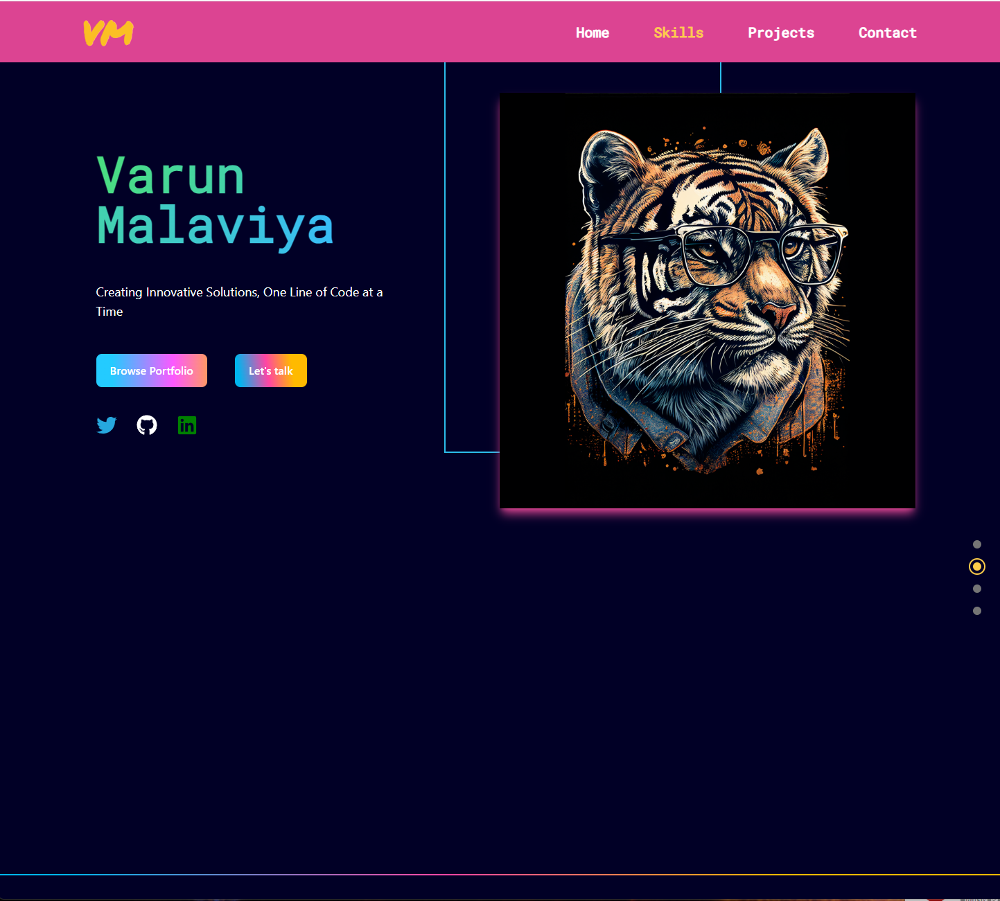

# <h1 align="center">Hi! I'm Varun 👋</h1> 

    I'm a passionate full stack engineer specializing in the MERN (MongoDB, Express.js, React, Node.js) tech stack. With a strong foundation in both front-end and back-end development, I thrive in creating robust and efficient web applications that meet the needs of modern businesses. Whether it's building intuitive user interfaces using React or designing scalable APIs with Express, I strive for excellence in every line of code I write. With a keen eye for detail and a passion for clean and maintainable code, I take pride in crafting elegant solutions that empower businesses to thrive in the digital landscape.

<h3 align="center">My Tech Stack</h3>

    
    
    
    
    
    

    

<h1 align="center">Let's Connect! &#129309;</h1>

 
    I'm always excited to collaborate on new projects or discuss web development ideas. Feel free to reach me at any of the social links listed in my bio! If you would like to see some projects I have created, check out my <a href='https://dustydogcodex.github.io/personal-portfolio/'>✨portfolio!✨</a> **Currently reworking my portfolio using Tailwindcss so some things might not work as expected**

Let's build something amazing together! 😄 

<h1 align="center">Recent Projects &#128221;</h1>

 
   WOW isn't it blowing your mind to see elegant, robust and ✨exquisite✨ code in every repo? Just kidding, don't go snooping through some of my repos. I haven't refactored old code and I do not have enough money to pay for any trauma you may endure from looking at haphazard code or how I deal with React Forms ;)

<table bordercolor="#66b2b2" >
  
<tr>
    <td width="50%" valign="top">
        <h3 align="center">Dost</h3>
         
        

        
        
 
         
        

            <!-- link to github repo -->
            <a 
                href="https://github.com/DustyDogCodex/Dost" 
                target="_blank"
            >
                <!-- logo for github repo -->
                
            </a>  
            <!-- link to live website -->
            <a 
                href="https://dost-production.up.railway.app/" 
                target="_blank"
            >
                <!-- logo for website -->
                
            </a>
        

        

            <strong>React, Express/NodeJs, MongoDb, TailwindCSS, PassportJS </strong> 
        

        

            A full stack clone of Facebook where users can create a profile, create posts with text and images and make/add friends to their social network.
        

    </td>
    <td width="50%" valign="top">
        <h3 align="center">Gasbnb</h3>
         
        <!--  --> 
         
        

              
            
        

        

            <strong>React, Node/Express, MongoDB, PassportJS, TailwindCSS </strong> 
        

        

            (currently working on final touches + deployment) - a responsive full stack MERN clone of Airbnb. Users can create bookings that they can rent out as well as see other people's offerings to reserve those.
        

    </td>
</tr>
  
<tr>
    <td width="50%" valign="top">
        <h3 align="center">Bloggy</h3>
         
        

        
        
 
         
        

            <!-- link to github repo -->
              
            <!-- link to live website -->
            
        

        

            <strong>React, Express/NodeJS, MongoDb, PassportJS, React-Bootstrap, Bootstrap</strong> 
        

        

            A full stack MERN blog application where users can read posts created by others and create accounts to write their own blog posts.
        

    </td>
    <td width="50%" valign="top">
        <h3 align="center">My Portfolio</h3>
         
        

        
        
 
         
        

            <!-- link to github repo -->
             
            <!-- link to live demo website --> 
            
        

        

            <strong>React, TailwindCSS, Framer-Motion</strong> 
        

        

            A fully responsive and beautiful portfolio website designed to showcase my Portfolio with projects I have created while also letting customers contact me directly through the website.
        

    </td>
</tr>

</table>

<h3 align="center">🌱 I’m currently also learning Typescript and Next.JS!</h3>

Thanks for visiting my GitHub Profile! I look forward to hearing from you soon! In the meantime, here's a VERY relatable and funny gif :) Have a great rest of your day!

      

